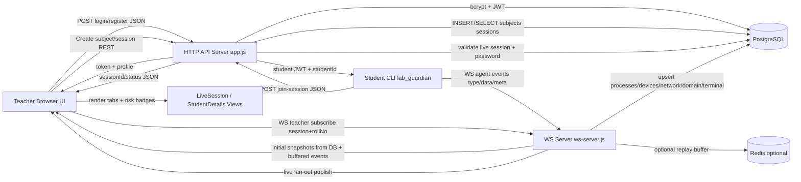

# LabGuardian Technical Architecture Audit

Generated on: 2026-04-20
Scope: Full workspace snapshot in this repository, including backend, frontend, Python agent, tests, packaging, infra, and local artifacts.

## 1) System Architecture Deep Dive

LabGuardian is a distributed real-time monitoring system with three runtime tiers:

- Teacher web app (React + Vite) for control and visualization.
- Backend API + WebSocket servers (Node.js) for auth, orchestration, persistence, and streaming.
- Student endpoint agent (Python) that observes machine activity and pushes telemetry.

### Runtime topology

- Frontend calls REST APIs on backend HTTP server.
- Student agents call join API, receive student JWT, then stream events to backend WS server.
- Backend WS server validates, persists, and re-broadcasts to subscribed teacher WS clients.
- PostgreSQL stores core data and telemetry snapshots/events.
- Redis is optional for replay buffer of recent WS events.

### Architectural intent

- Separation of concerns: HTTP and WS are separate server surfaces.
- Event-driven telemetry: agent pushes deltas/snapshots; backend fan-outs to teacher subscribers.
- Idempotent upsert-heavy storage for volatile telemetry.
- Thin frontend API layer + view models over server-generated state.

---

## 2) File-Level Directory and Purpose (Every File)

Note: package-lock files and egg-info metadata are generated artifacts; they still appear below because they exist in the repository snapshot.

## 2.1 Root Files

| File | Core responsibility (reason for existing) | Functional logic / APIs used |
|---|---|---|
| `.gitignore` | Keep local/build/secrets out of git | Ignore patterns for venv, node_modules, .env, caches |
| `README.md` | Product-level documentation | Describes architecture, features, setup |
| `temp_edge.db` | Local temporary browser-history SQLite artifact | Data file, no executable logic |
| `temp_history.db` | Local temporary browser-history SQLite artifact | Data file, no executable logic |

## 2.2 Backend Top-Level

| File | Core responsibility | Functional logic / APIs used |
|---|---|---|
| `backend/.dockerignore` | Reduce Docker build context | Excludes node_modules/logs |
| `backend/docker-compose.yml` | Local stack orchestration | Defines postgres, redis, backend services, healthchecks, env wiring |
| `backend/Dockerfile` | Backend image build recipe | Node 20 Alpine, npm install, exposes 8000/8001 |
| `backend/package.json` | Backend dependency and scripts contract | Scripts: start/dev/ws/migrate/cleanup/test; deps: express/ws/pg/redis/jwt/bcrypt |
| `backend/package-lock.json` | Deterministic npm dependency lock | Generated resolver tree |
| `backend/README.md` | Backend-specific technical documentation | Endpoint descriptions and architecture notes |

## 2.3 Backend Application Core

| File | Core responsibility | Functional logic breakdown |
|---|---|---|
| `backend/src/app.js` | Compose Express middleware and route graph | Configures CORS allowlist, JSON body parser, health endpoint, route mounts, 404 fallback, terminal error middleware |
| `backend/src/server.js` | HTTP process entrypoint and lifecycle | Loads env, starts HTTP server on configured port, starts WS server, graceful SIGINT/SIGTERM shutdown with db pool close |
| `backend/src/ws-server.js` | Real-time ingest, authorization, persistence routing, fan-out | Path parser for agent/teacher roles; JWT extraction+verify; role/path/session checks; heartbeat timeouts; per-student rate limiter; message validator; dispatch switch to service methods; optional Redis ring buffer; teacher snapshot bootstrap; publish/unsubscribe |
| `backend/src/config/index.js` | Centralized runtime configuration | Reads env with defaults, exports immutable config, lazy singleton Redis client with fallback |
| `backend/src/db/index.js` | PostgreSQL connectivity layer | Creates `pg.Pool`, slow query logging, query helper, transactional client accessor |

## 2.4 Backend Controllers

| File | Core responsibility | Functional logic breakdown |
|---|---|---|
| `backend/src/controllers/authController.js` | Register/login/logout HTTP handlers | Register validates fields, checks unique email, bcrypt hash insert; login fetches teacher, bcrypt compare, JWT sign, response envelope; logout clears cookie and returns message |
| `backend/src/controllers/dashboardController.js` | Dashboard aggregate stats endpoint | One SQL query with scalar subqueries for total subjects, active sessions, total sessions; snake_case to camelCase output |
| `backend/src/controllers/sessionsController.js` | Session create/read/end endpoints | Validates payload, enforces teacher subject ownership, creates live session, lists with status filter, fetches single session plus student count, ends session by setting `is_live=false`/`end_time=now()` |
| `backend/src/controllers/studentsController.js` | Student join and teacher-facing student telemetry read APIs | Join flow: validate, live-session/password check, student upsert, session_student upsert, student JWT 1h; profile/enrolled subjects query; devices/network/process/domain endpoints with 2s in-memory cache |
| `backend/src/controllers/subjectsController.js` | Subject CRUD (list/create) for teacher | Subject list with session counts and live boolean via aggregate; insert subject with optional department/year |

## 2.5 Backend Routes

| File | Core responsibility | Functional logic |
|---|---|---|
| `backend/src/routes/auth.js` | Auth route registration | POST login/register/logout wrappers via asyncHandler |
| `backend/src/routes/dashboard.js` | Dashboard route registration | JWT-protected GET dashboard |
| `backend/src/routes/sessions.js` | Session route registration | JWT middleware then create/list/get/end |
| `backend/src/routes/students.js` | Student/teacher mixed route registration | Public join-session route; protected teacher routes for session student list, processes, profile/devices/network/domain activity |
| `backend/src/routes/subjects.js` | Subject route registration | JWT-protected list/create |

## 2.6 Backend Services

| File | Core responsibility | Functional logic breakdown |
|---|---|---|
| `backend/src/services/deviceService.js` | Device and network persistence abstraction | Upserts connected devices with enrichment fields (`readable_name`, `risk_level`, `message`), snapshot bulk upsert, disconnect marker, active-device retrieval split by type, network_info upsert/get |
| `backend/src/services/networkService.js` | Domain and terminal event persistence abstraction | Domain activity increment upserts by domain key; terminal event insert schema mapping; fetch latest terminal events |
| `backend/src/services/processService.js` | Process snapshot/delta persistence abstraction | Upsert process row on key `(session,student,pid)`, snapshot bulk handling, update partial metrics/status, mark ended, retrieve sorted process list |
| `backend/src/services/sessionService.js` | Session/student helpers used mostly by WS server | Live session lookup, session_student upsert/touch, student lookup, teacher session ownership check |
| `backend/src/services/studentService.js` | Join-session helper primitives | Upsert student by roll number, ensure attendance row, fetch session by id |
| `backend/src/services/wsPublisher.js` | In-memory pub/sub registry for teacher sockets | Maintains Map-of-Map-of-Set subscriptions, subscribe/unsubscribe/unsubscribeAll, publish by student and publishToSession |

## 2.7 Backend Middleware and Utilities

| File | Core responsibility | Functional logic |
|---|---|---|
| `backend/src/middleware/auth.js` | JWT auth guard | Extracts Bearer/query token, verifies JWT, maps payload to `req.user`, exports verifier for WS handshake |
| `backend/src/middleware/errorHandler.js` | Unified API error output | Converts thrown errors to status code + `{ error }` JSON |
| `backend/src/utils/cache.js` | Short-lived endpoint cache | In-memory TTL key-value cache with `cached`, `invalidate`, `clearCache` |
| `backend/src/utils/helpers.js` | Common utility helpers | async handler wrapper, typed HTTP error constructor, pick, snake_case to camelCase mappers |

## 2.8 Backend DB Migrations and Scripts

| File | Core responsibility | Functional logic |
|---|---|---|
| `backend/src/db/migrations/001_create_tables.sql` | Initial relational schema | Creates extensions, core tables, constraints, and indexes |
| `backend/src/db/migrations/002_add_insights_columns.sql` | Non-destructive schema enrichment | Adds risk/label/message columns, ensures domain_activity table/index |
| `backend/src/db/migrations/003_add_terminal_events.sql` | Terminal event persistence support | Creates `terminal_events` table and indexes |
| `backend/src/scripts/migrate.js` | Migration runner | Reads all .sql files in order and executes sequentially against DATABASE_URL |
| `backend/src/scripts/cleanup.js` | Data retention cleanup tool | Deletes old monitoring rows and ended sessions older than retention window |

## 2.9 Backend Tests

| File | Core responsibility | Functional logic |
|---|---|---|
| `backend/tests/unit/auth.test.js` | Validate auth controller and middleware behavior | Mocks db/bcrypt/jwt; tests missing creds, wrong creds, success token shape, middleware token handling |
| `backend/tests/unit/cache.test.js` | Validate cache semantics | Tests hit/miss/expiry/invalidate/clear |
| `backend/tests/unit/dashboard.test.js` | Validate dashboard aggregates and error path | Mocks DB aggregate result and failure handling |
| `backend/tests/unit/joinSession.test.js` | Validate join-session rule enforcement | Mocks studentService+jwt; tests required fields, missing/not-live session, bad password, happy path |
| `backend/tests/e2e/flow.test.js` | Scripted full API smoke flow | Login -> create subject -> create session -> dashboard/list -> end session assertions |
| `backend/tests/e2e/seed.js` | Test data bootstrap for e2e | Inserts teacher and sample students with conflict-safe inserts |
| `backend/tests/e2e/ws-agent-test.js` | Manual WS event stream simulator | Opens agent socket and sends sample process/device/network/heartbeat events |

## 2.10 Frontend Top-Level and Build Tooling

| File | Core responsibility | Functional logic |
|---|---|---|
| `frontend/.gitignore` | Ignore frontend local/build files | Ignores dist, node_modules, local env files, editor state |
| `frontend/index.html` | Vite HTML entry | Root DOM mount and module script to `src/main.tsx` |
| `frontend/package.json` | Frontend dependency and scripts contract | Scripts for dev/build/lint/preview/typecheck; deps include React Router, lucide icons |
| `frontend/package-lock.json` | Deterministic npm lock | Generated dependency graph |
| `frontend/README.md` | Frontend-focused documentation | Describes pages, design system, expected backend contracts |
| `frontend/eslint.config.js` | JS/TS linting rules | TypeScript-eslint + react hooks + refresh rules |
| `frontend/postcss.config.js` | CSS transform pipeline | Tailwind + autoprefixer plugins |
| `frontend/tailwind.config.js` | Tailwind scanner/theme config | Content globs and theme extension entrypoint |
| `frontend/tsconfig.json` | TS project references root | References app and node tsconfig files |
| `frontend/tsconfig.app.json` | TS compile/lint rules for app code | Strict options, bundler module resolution, noEmit |
| `frontend/tsconfig.node.json` | TS compile/lint rules for vite config | Strict options for node-side TS file |
| `frontend/vite.config.ts` | Vite bundler/runtime config | React plugin enabled, optimizeDeps excludes lucide-react |
| `frontend/.bolt/config.json` | Bolt template metadata | Marks scaffold template |
| `frontend/.bolt/prompt` | Bolt style directives | Design instructions for generated UI output |

## 2.11 Frontend App Runtime Files

| File | Core responsibility | Functional logic breakdown |
|---|---|---|
| `frontend/src/main.tsx` | Browser bootstrap entry | Creates React root and renders `App` under `StrictMode` |
| `frontend/src/App.jsx` | App shell and providers | BrowserRouter + SessionProvider + route rendering via `useRoutes` |
| `frontend/src/routes.jsx` | Route table and auth gate | ProtectedRoute checks localStorage token and redirects unauthenticated users |
| `frontend/src/vite-env.d.ts` | Vite env type declarations | Declares `VITE_API_BASE` and `VITE_WS_BASE` |
| `frontend/src/index.css` | Global styles and utility animations | Imports tokens, applies base element styles, defines fade/slide/shake/pulse keyframes |
| `frontend/src/styles/tokens.css` | Design token system | CSS variables for color/spacing/typography/shadows/z-index |
| `frontend/src/context/SessionContext.jsx` | Cross-page live-session state | On startup fetches live session list, stores first live session, exposes start/end/refresh helpers |
| `frontend/src/services/api.js` | REST client adapter | Fetch wrappers for auth/subjects/sessions/students; bearer token injection; central response/error and 401 redirect handling |
| `frontend/src/services/socket.js` | Teacher websocket client abstraction | Connect, reconnect with exponential backoff, heartbeat watchdog, event emitter model, manual close semantics |

## 2.12 Frontend Pages

| File | Core responsibility | Functional logic breakdown |
|---|---|---|
| `frontend/src/pages/Login.jsx` | Teacher sign-in view | Controlled form, calls auth login API, stores token and teacherName, navigates dashboard |
| `frontend/src/pages/Register.jsx` | Teacher registration view | Controlled form, calls register API, navigates login on success |
| `frontend/src/pages/Dashboard.jsx` | Dashboard KPI view | Loads subjects and sessions in parallel, computes card stats, uses SessionContext for active marker |
| `frontend/src/pages/MySubjects.jsx` | Subject listing and creation | Fetches subjects, modal form to POST new subject, refreshes list |
| `frontend/src/pages/CreateSession.jsx` | Session creation form | Loads subjects, posts session with current date/time defaults, updates SessionContext, routes to live session |
| `frontend/src/pages/MySessions.jsx` | Session listing page | Fetches all sessions and renders live/ended action buttons |
| `frontend/src/pages/LiveSession.jsx` | Live session roster and control | Polls session + students every 5s, computes elapsed timer, search filter, end-session modal/action, routes to student details with query sessionId |
| `frontend/src/pages/StudentDetails.jsx` | Deep per-student telemetry console | Initial REST profile/devices/network fetch then WS subscription; reducers for process/device/domain/browser/terminal event streams; risk tab views and connection-status UX |

## 2.13 Frontend Components

| File | Core responsibility | Functional logic |
|---|---|---|
| `frontend/src/components/layout/Sidebar.jsx` | Primary navigation rail | Menu config and route navigation with active-state styling |
| `frontend/src/components/layout/Topbar.jsx` | Header + logout + live banner | Reads teacher name, logout clears storage/context, optional live banner resume action |
| `frontend/src/components/layout/LiveSessionBanner.jsx` | Reusable live-session banner | Click-through routing to active session |
| `frontend/src/components/session/StudentListItem.jsx` | Student row renderer | Memoized row with status indicator and relative last-seen formatting |
| `frontend/src/components/ui/Button.jsx` | Shared button primitive | Variant and size class maps, loading spinner state |
| `frontend/src/components/ui/Card.jsx` | Shared card primitive | Optional hoverable behavior and pass-through props |
| `frontend/src/components/ui/InputField.jsx` | Shared labeled input field | Label, validation style switch, error text rendering |
| `frontend/src/components/ui/Modal.jsx` | Shared modal/dialog primitive | Body scroll lock, ESC close, overlay click close, sized panel rendering |
| `frontend/src/components/ui/SearchBar.jsx` | Debounced text search control | Internal state with timeout-driven `onSearch` callback |
| `frontend/src/components/ui/StatusBadge.jsx` | Status label visualization | Maps status key to label/colors for live/ended/risk states |

## 2.14 Python Agent Top-Level

| File | Core responsibility | Functional logic |
|---|---|---|
| `Lab_guardian/README.md` | Agent-specific docs and ops notes | Installation, auditd setup, monitor event taxonomy |
| `Lab_guardian/requirements.txt` | Runtime python dependency manifest | psutil/websockets/requests/netifaces/pyudev pins |
| `Lab_guardian/setup.py` | Python package build metadata | setuptools config, console script entrypoint |
| `Lab_guardian/setup.sh` | Installer and OS bootstrap script | Installs packages, optional auditd rules, installs editable package, verification output |
| `Lab_guardian/test_browser_paths.py` | Browser DB path diagnostics utility | Scans known paths and prints found/not-found with sizes |
| `Lab_guardian/test_firefox_history.py` | Firefox history parsing diagnostics utility | Reads places.sqlite copy, validates timestamp conversion and filters |
| `Lab_guardian/systemd/lab_guardian.service` | systemd unit for agent | Service execution, restart policy, env-file integration, sandboxing |
| `Lab_guardian/debian/control` | Debian package metadata | Declares package fields and dependencies |
| `Lab_guardian/debian/postinst` | Debian post-install hook | Installs package, creates config dir, installs systemd service |
| `Lab_guardian/debian/prerm` | Debian pre-remove hook | Stops/disables service and uninstalls python package |

## 2.15 Python Agent Package Source

| File | Core responsibility | Functional logic breakdown |
|---|---|---|
| `Lab_guardian/lab_guardian/__init__.py` | Package marker and version source | Defines `__version__` |
| `Lab_guardian/lab_guardian/api.py` | HTTP join-session client | POST JSON to `/api/students/join-session`, raises on non-2xx |
| `Lab_guardian/lab_guardian/cli.py` | CLI entrypoint and lifecycle orchestration | argparse subcommands, interactive prompts, config override via flags, join API call, event loop + signal handling |
| `Lab_guardian/lab_guardian/config.py` | Runtime tunables and defaults | URL endpoints, monitor intervals, reconnect bounds, thresholds from env |
| `Lab_guardian/lab_guardian/dispatcher.py` | Concurrent monitor orchestration | Queue-based producer/consumer between monitors and ws client; starts monitor tasks and cancellation strategy |
| `Lab_guardian/lab_guardian/ws_client.py` | Robust persistent WS transport | Outbound queue, connect/reconnect with backoff+jitter, ack config override, reader/writer tasks, stop event |
| `Lab_guardian/lab_guardian/monitor/__init__.py` | Monitor package marker | Namespace only |
| `Lab_guardian/lab_guardian/monitor/process_monitor.py` | Process telemetry engine | psutil snapshotting, process classification (safe/suspicious/dangerous/incognito), diff algorithm for new/update/end, thresholded delta emission |
| `Lab_guardian/lab_guardian/monitor/device_monitor.py` | USB/removable device telemetry engine | Polls disk partitions, enriches metadata/vendor/model, classifies risk, snapshot + add/remove events, optional pyudev fast path |
| `Lab_guardian/lab_guardian/monitor/network_monitor.py` | Terminal/network telemetry engine | Layer 1: `ss -tnp` parse + dedupe; Layer 2: auditd EXECVE tail + command reconstruction; emits terminal events and periodic network snapshot |
| `Lab_guardian/lab_guardian/monitor/browser_history.py` | Browser history extraction engine | Locates browser SQLite DBs, safely copies and queries history rows, normalizes timestamps, returns urls since agent start |

## 2.16 Python Packaging Metadata (Generated)

| File | Core responsibility | Functional logic |
|---|---|---|
| `Lab_guardian/lab_guardian.egg-info/dependency_links.txt` | setuptools metadata stub | Generated file (empty/whitespace) |
| `Lab_guardian/lab_guardian.egg-info/entry_points.txt` | CLI entrypoint metadata | Declares console script `lab_guardian=lab_guardian.cli:main` |
| `Lab_guardian/lab_guardian.egg-info/PKG-INFO` | Package metadata snapshot | Name/version/dependencies/classifiers |
| `Lab_guardian/lab_guardian.egg-info/requires.txt` | Resolved package requirements | Mirrors runtime dependencies |
| `Lab_guardian/lab_guardian.egg-info/SOURCES.txt` | Source file manifest | Lists files included in package build |
| `Lab_guardian/lab_guardian.egg-info/top_level.txt` | Top-level import package list | Declares `lab_guardian` package root |

## 2.17 Dev Utilities

| File | Core responsibility | Functional logic |
|---|---|---|
| `dev/agent-docker/Dockerfile` | Agent container build | Python 3.11 slim image, system libs, pip installs, default `lab_guardian join` command |
| `dev/tests/integration.sh` | End-to-end shell smoke harness | Brings up infra, runs migrations, starts servers, seeds session, starts agent, validates DB telemetry row count |

---

## 3) Functional Logic Breakdown by Layer

## 3.1 Backend Execution Model

- API path:
  - `app.js` mounts route modules and middleware.
  - route files map URIs to controller handlers.
  - controllers validate/authorize and call db/service helpers.
  - service modules isolate SQL mutations/queries.
  - helpers map SQL snake_case to frontend-friendly camelCase.

- WS path:
  - `ws-server.js` authenticates upgrade request and route role.
  - agent messages are validated against allowed types.
  - per-type switch executes persistence operation in relevant service.
  - event is optionally buffered in Redis and published to teacher subscribers.
  - teacher connection receives initial snapshots from DB + buffered replay.

## 3.2 Frontend Rendering and State Model

- Routing and auth:
  - `routes.jsx` enforces token presence using localStorage gate.

- Data acquisition patterns:
  - Snapshot/polling pages (`LiveSession`) use periodic REST polling every 5s.
  - Realtime page (`StudentDetails`) combines initial REST snapshot and WS streaming deltas.

- State management:
  - local state per page with hooks.
  - shared live-session state in `SessionContext`.
  - `socket.js` provides event bus semantics over browser WebSocket.

## 3.3 Python Agent Processing Model

- Join and bootstrap:
  - CLI obtains roll/session/password (args or prompt), calls join endpoint.
  - receives short-lived student token + canonical student/session IDs.

- Producer-consumer pipeline:
  - monitors enqueue events to in-memory bounded queue.
  - drain coroutine forwards queue to `ws_client.send`.
  - ws client handles reconnect and server configuration override.

- Monitor algorithms:
  - Process monitor: periodic snapshots + diff deltas using PID keys.
  - Device monitor: current device set diff and periodic snapshot.
  - Network monitor: parse `ss` connections + parse auditd EXECVE lines.
  - Browser history monitor: query browser SQLite histories filtered by agent start timestamp.

---

## 4) End-to-End Data Lifecycle

## 4.1 Flow A: Teacher Authentication and Session Boot

### Origin (Fetch)

- Triggered by teacher in login/register UI (`Login.jsx`, `Register.jsx`).
- Payload format (JSON):
  - register input: `{ "name": string, "email": string, "password": string }`
  - login input: `{ "email": string, "password": string }`

### Transit

- Frontend `api.js` sends HTTP request to backend `/api/auth/*`.
- Token response is persisted into localStorage and reused as Bearer token.

### Engine (Processing)

- `authController.js`:
  - register: email uniqueness check + bcrypt hash insert.
  - login: password verify + JWT sign with teacher identity.
- `auth.js` middleware decodes JWT for protected teacher endpoints.

### Destination (Display)

- Login success routes user to dashboard and unlocks protected routes.
- Dashboard cards derive counts via subject/session APIs.

### Data formats

- Output (login): `{ "token": string, "name": string, "role": "teacher", "teacherId": uuid }`.

## 4.2 Flow B: Subject and Session CRUD

### Origin

- `MySubjects.jsx` and `CreateSession.jsx` form submissions.

### Transit

- Frontend REST calls:
  - `POST /api/teacher/subjects`
  - `POST /api/teacher/sessions`
  - `GET /api/teacher/sessions?status=...`

### Engine

- `subjectsController.js` writes/reads `subjects`.
- `sessionsController.js` verifies ownership (`subjects.teacher_id`), creates live session row, lists and terminates sessions.

### Destination

- Session list and live page render from API responses (`MySessions`, `LiveSession`).

### Data formats

- Session create input: `{ "subjectId": uuid, "batch": string, "lab": string, "date": "YYYY-MM-DD", "startTime": "HH:mm", "password"?: string }`
- Session output: `{ "sessionId": uuid, "isLive": boolean, ... }`

## 4.3 Flow C: Student Join + Agent Telemetry Ingest

### Origin

- Student-side CLI command (`lab_guardian join ...`) calls join API.
- After join, monitors produce telemetry events.

### Transit

- HTTP: `POST /api/students/join-session`.
- WS: `ws://.../ws/agents/sessions/{sessionId}/students/{studentId}?token={jwt}`

### Engine

- Join path (`studentsController.joinSession`): session/password validation, student upsert, attendance upsert, student JWT issuance.
- WS ingest (`ws-server.js`): message type validation, heartbeat touch, service-layer persistence.
- DB writes:
  - processes -> `live_processes`
  - devices -> `connected_devices`
  - network snapshots -> `network_info`
  - domains -> `domain_activity`
  - terminal requests/commands -> `terminal_events`

### Destination

- Teacher WS subscriber receives initial snapshot + live event stream.
- Student detail tabs update from streamed deltas.

### Data formats

- Join response: `{ "token": string, "studentId": uuid, "sessionId": uuid, "expiresIn": 3600 }`
- Agent WS envelope:
  - `{ "type": string, "data": object|array, "ts"?: number, "meta"?: { "risk_level"?: string, "category"?: string, "message"?: string } }`

## 4.4 Flow D: Teacher Monitoring Render Loop

### Origin

- Teacher opens `LiveSession` and then `StudentDetails`.

### Transit

- `LiveSession`: REST polling each 5s (`session`, `session students`).
- `StudentDetails`: opens teacher WS connection and listens for event types.

### Engine

- `socket.js` emits event callbacks.
- `StudentDetails.jsx` handlers merge/replace state:
  - process snapshot replace; process deltas mutate list.
  - device connect/disconnect mutate grouped device state.
  - domain activity merges counters by domain.
  - browser history merges by URL and sorts by timestamp.
  - terminal events prepend and cap list length.

### Destination

- UI tabs display transformed state with risk badges and grouped process rendering.

### Data formats

- Frontend local state examples:
  - `processes: Array<{ pid:number, name:string, cpu:number, memory:number, status:string, risk_level?:string, category?:string }>`
  - `devices: { usb: Array<object>, external: Array<object> }`
  - `terminalEvents: Array<{ event_type:string, tool:string, full_command?:string, remote_ip?:string, risk_level:string, detected_at:string }>`

---

## 5) Mermaid Data Flow

---

## 6) Data Schemas and Formats at Each Stage

## 6.1 Core relational schema (actual tables)

- `teachers(id, email, name, password_hash, role, created_at)`
- `students(id, roll_no, name, email, department, year, created_at)`
- `subjects(id, teacher_id, name, department, year, created_at)`
- `sessions(id, subject_id, batch, lab_name, date, start_time, end_time, is_live, password, created_by, created_at)`
- `session_students(id, session_id, student_id, last_seen_at, current_status, joined_at)`
- `connected_devices(id, session_id, student_id, device_id, device_name, device_type, connected_at, disconnected_at, metadata, readable_name, risk_level, message)`
- `network_info(id, session_id, student_id, ip_address, gateway, dns, active_connections, updated_at)`
- `live_processes(id, session_id, student_id, pid, process_name, cpu_percent, memory_mb, status, updated_at, risk_level, category)`
- `process_history(...)` optional historical table
- `domain_activity(id, session_id, student_id, domain, request_count, risk_level, last_accessed)`
- `terminal_events(id, session_id, student_id, event_type, tool, remote_ip, remote_host, remote_port, pid, full_command, risk_level, message, detected_at)`

## 6.2 REST JSON contracts (representative)

- Login output:
  - `{ "token": "...", "name": "...", "role": "teacher", "teacherId": "uuid" }`
- Session student list output:
  - `[{ "rollNo": "CS001", "name": "Alice", "status": "normal", "lastSeen": "ISO" }]`
- Devices output:
  - `{ "usb": [{ "deviceId": "...", "readableName": "SanDisk Ultra", "riskLevel": "high" }], "external": [] }`
- Processes output:
  - `[{ "pid": 123, "processName": "python", "cpuPercent": 10.2, "memoryMb": 55.3, "status": "running", "riskLevel": "medium", "category": "suspicious" }]`

## 6.3 WS event formats

- Agent to server:
  - `process_snapshot`, `process_new`, `process_update`, `process_end`
  - `devices_snapshot`, `device_connected`, `device_disconnected`
  - `network_snapshot`, `network_update`
  - `domain_activity`
  - `terminal_request`, `terminal_command`
  - `browser_history`
  - `heartbeat`

- Server to teacher:
  - relayed agent events plus `terminal_events_snapshot` and `agent_offline`

## 6.4 Frontend state shapes

- SessionContext:
  - `{ liveSession: object|null, loading: boolean, startSession(), endSession(), refreshLiveSession() }`
- StudentDetails local state:
  - `student`, `devices`, `network`, `processes`, `domainActivity`, `browserHistory`, `terminalEvents`, `connectionStatus`

---

## 7) Processing Engines and Validation Paths

- Auth validation:
  - Required-field checks at controller level.
  - Password hash compare with bcrypt.
  - JWT sign/verify with shared secret.

- WS validation:
  - Path-role validation and token-to-path matching for agent sockets.
  - Teacher session ownership check before subscription.
  - Message type whitelist and data requirement checks.
  - Rate limiting for process update bursts.

- Telemetry enrichment:
  - Agent process classifier labels risk/category and detects incognito flags.
  - Device monitor enriches vendor/model -> readable labels.
  - Network monitor marks suspicious terminal usage by tool/domain.

---

## 8) Cache and Freshness Model

- Backend in-memory TTL cache (`cache.js`) used by student telemetry snapshot endpoints.
- Key patterns include `devices:{sessionId}:{studentId}`, `network:*`, `procs:*`, `domains:*`.
- TTL currently 2000ms in controller usage.
- Redis (if available) stores last ~100 WS events per student for ~1 hour replay.

---

## 9) Test Coverage Mapping

- Unit tests cover:
  - auth behavior and middleware gate
  - join-session validation matrix
  - cache semantics
  - dashboard aggregate output

- E2E scripts cover:
  - API CRUD and session lifecycle smoke path
  - WS event simulation from pseudo-agent

- Gaps:
  - No frontend unit/integration tests in this snapshot.
  - No automated Python monitor unit tests in package source (diagnostic scripts exist).

---

## 10) Notable Architectural Risks and Contract Mismatches

1. `api.js` student device/network methods do not append `sessionId` query param, but backend endpoints require it (`studentsController` returns 400 when missing).
2. Login page stores `teacherName` from `response.teacherName`, while backend returns `name`; this can produce missing teacher display name.
3. `process_monitor.py` emits `process_snapshot`, while some docs mention `processes_snapshot`; runtime uses `process_snapshot` in backend WS validator.
4. Session password is stored in plaintext in `sessions.password` (no hash).
5. Student JWT expiry is fixed at 1 hour; long sessions can outlive token validity for reconnects.

---

## 11) End-to-End Trace (Condensed)

1. Teacher logs in -> JWT issued -> frontend stores token.
2. Teacher creates subject/session -> session becomes live.
3. Student agent joins session -> gets student JWT.
4. Agent opens WS and streams process/device/network/terminal/browser events.
5. WS server validates + persists + publishes.
6. Teacher opens student details -> receives DB snapshot + live deltas.
7. Frontend merges events into state and renders tabs/risk indicators.
8. Teacher ends session -> session `is_live=false`, end time recorded.

---

## 12) Summary

This repository implements a practical event-driven proctoring platform where control-plane operations are REST-centric and telemetry-plane operations are WS-centric. The file layout is cleanly layered by function (controllers/services/monitors/components), and the primary data lifecycle from agent capture to teacher visualization is explicit and traceable through the listed files.
